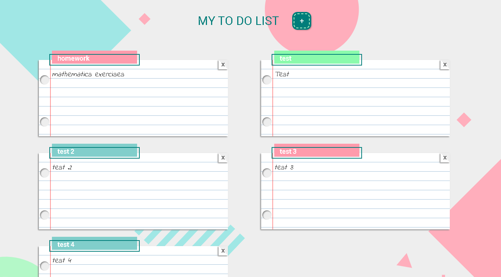
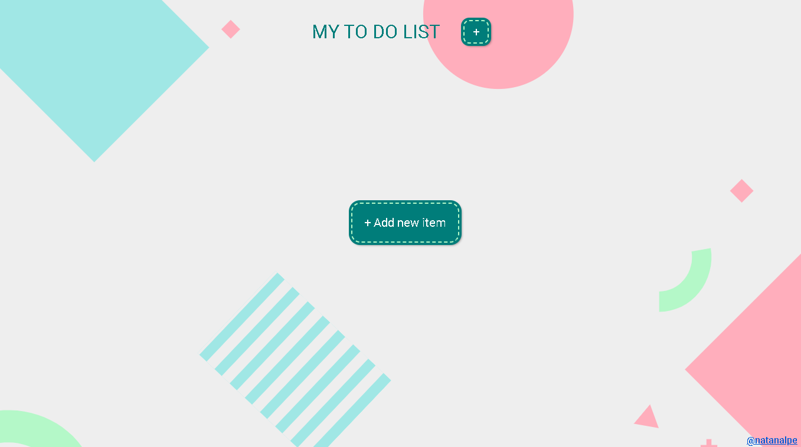

---


  - [Descrição](#descrição)
  - [Funcionalidades](#funcionalidades)
  - [Construido com](#construido-com)
  - [Como executar o projeto](#como-executar-o-projeto)
  - [Screenshots](#screenshots)
  - [Links](#links)
  - [Autor](#autor)

---
  ### Descrição:
  - Com uma interface simples e intuitiva, permite que os usuários organizem suas tarefas, adicionando novas tarefas e removendo tarefas que não são mais relevantes.
  
---
  ### Funcionalidades:
  - Interface interativa e intuitiva.
  - Armazena as tarefas, mantendo-as para uma próxima visita ao app.
---
  ### Construido com
  - [React](https://react.dev/)
  - [Styled-components](https://styled-components.com/)
  - [React-router-dom](https://reactrouter.com/en/main)
  - [Netlify](https://www.netlify.com/)
---
  ### Como executar o projeto:
  - Clone o repositório em sua maquina
  - Abra o terminal e navegue até o diretório raiz do projeto
  - Execute os seguintes comandos:
  ```
     npm install
     npm start
  ```
  - Será indicado no terminal o link para acessar o projeto em seu navegador.
---
  ### Screenshots:

  
  

---
  ### Links:
- PageSpeed Insights: [Vizualizar insights]([https://pagespeed.web.dev/analysis/https-todo-natanalpe-netlify-app/ug316le6s4?form_factor=desktop])
- Deploy: [Vizualizar projeto](https://todo-natanalpe.netlify.app/)
---
  ### Autor:
  - Github - [@Natanalpe](https://github.com/natanalpe)
  - Linkedin - [Natan Altomar Pereira](https://www.linkedin.com/in/natanalpe14/)